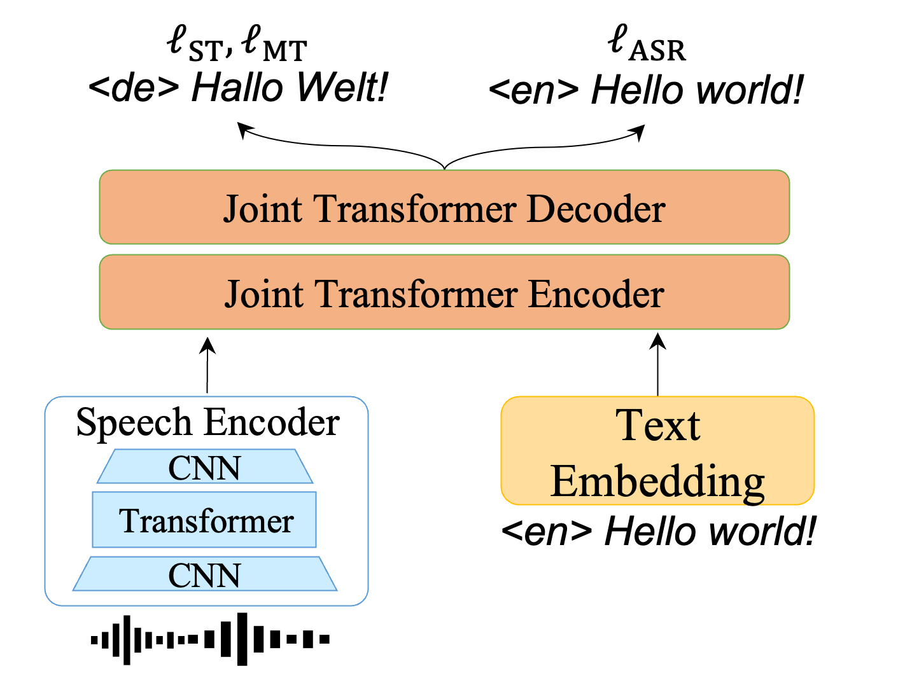
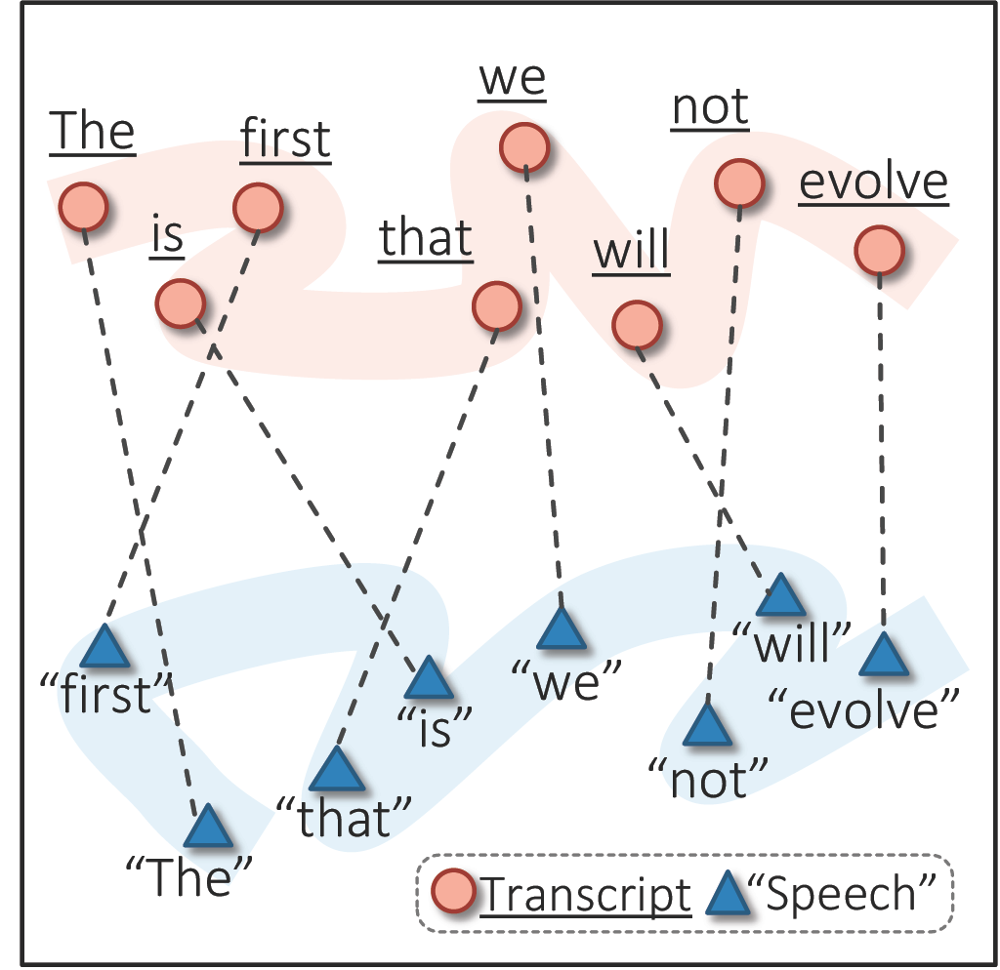
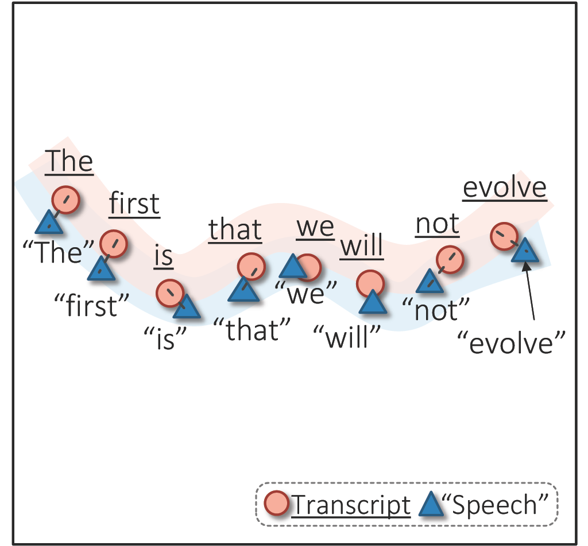
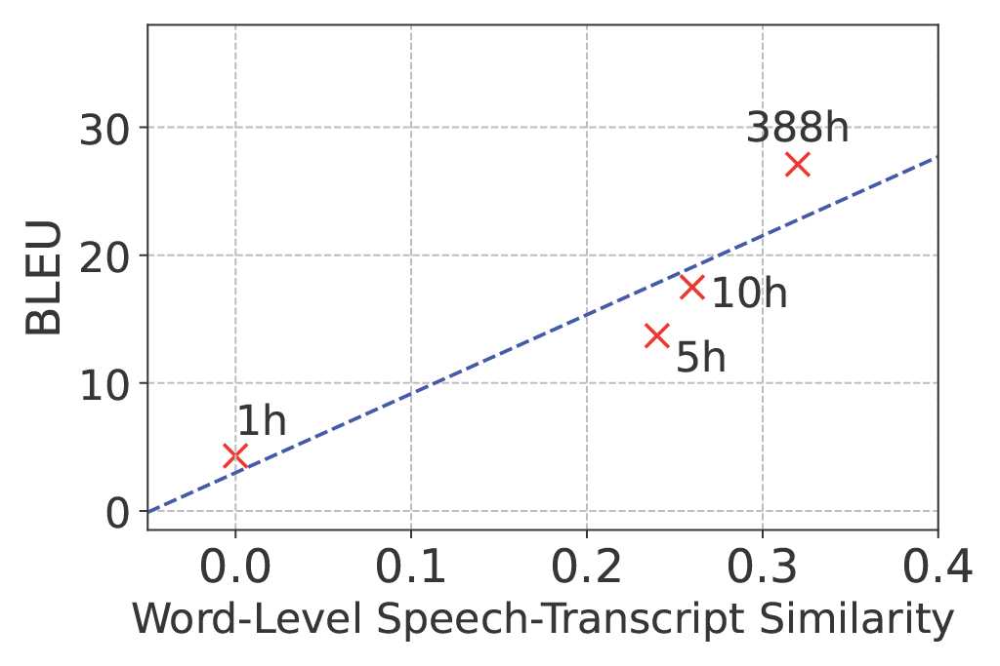
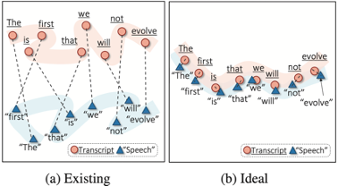
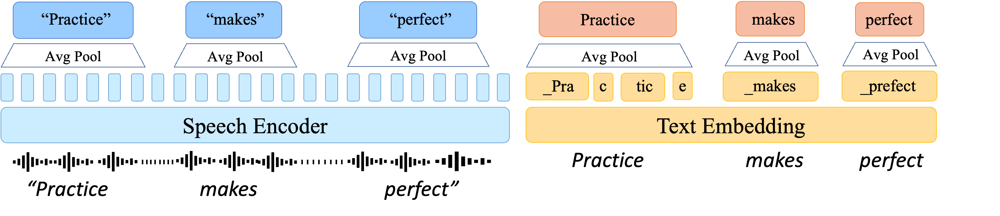
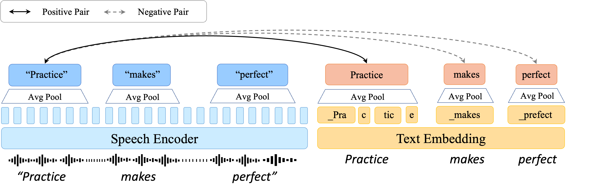
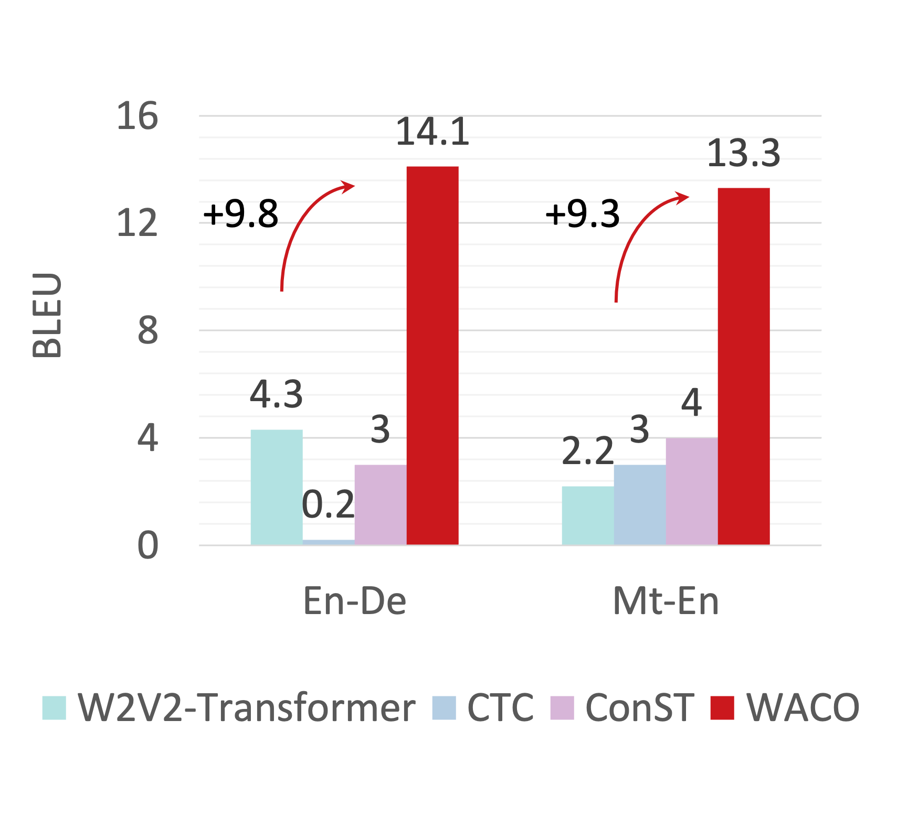
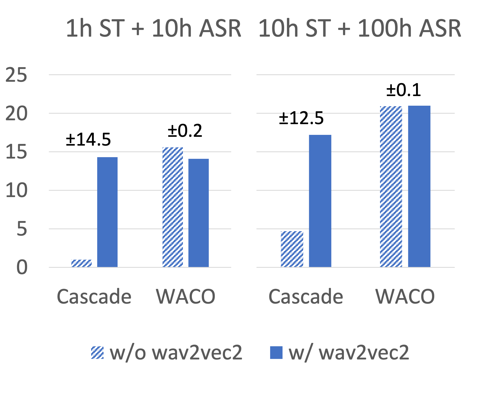

<!-- # WACO: Word-Aligned Contrastive Learning for Speech Translation

Siqi Ouyang1, Rong Ye2, Lei Li1

1University of California, Santa Barbara, 2Bytedance

\[[Arxiv](https://arxiv.org/abs/2212.09359)\] \[[Code](https://github.com/owaski/WACO)\] -->

## What is End-to-End Speech Translation and its core challenge?

End-to-end speech translation (E2E ST) is the task of translating speech in one language to text in another language without generating intermediate transcript. E2E ST holds the hope for lower latency and less error propagation compared to cascade ST with automatic speech recognition (ASR) and machine translation (MT). **However, just like other E2E models, the performance of existing E2E ST models is still far from satisfactory when parallel data is scarce.**

<figure>
    
    <!-- <figcaption>Existing</figcaption> -->
</figure>

For those who are not familiar with ST, a typical parallel ST data point consists of a source speech waveform, its transcript and target translation. We usually count the amount of parallel ST data using the number of hours of speech. For example, the most widely used dataset MuST-C[1] contains around 400 hours of speech (~225k data points) for English-German direction. By scarce, we mean the amount of parallel ST data is less than 10 hours, e.g., Maltese-English direction in [IWSLT 2023](https://iwslt.org/2023/low-resource).

## Why word-level alignment is important for low-resource E2E ST?

We begin by analyzing the representatinon learned by an existing E2E ST model[2] with the below architecture, which is a dual-modal architecture suitable for multi-task training (e.g., ASR, MT and ST). 

<figure>
    
    <!-- <figcaption>Existing</figcaption> -->
</figure>

Specifically, we measure the cosine similarity between outputs of speech encoder and text embedding given speech waveform and its transcript as input, and observed two important phenomena:
1. The average representations from speech and its transcript are similar at the sequence level but misaligned at the word level. As shown in below figure, we want the representations of each word to be aligned.

    <figure>
        
        
        <figcaption>Existing (left) and Ideal (right) Alignment</figcaption>
    <figure>

2. Word-level misalignment is more severe in low-resource settings. In the below figure, we trained an existing E2E ST model on 1/5/10/388 hours of parallel data and plotted the average cosine similarity between the representations of each word in speech and its transcript. We can see that the word-level alignment is worse as we decreases the amount of parallel training data and so is the translation performance.

    <figure>
        
    <figure>

<!-- 

 -->

These two phenomea together indicate that **word-level alignment could be the key to improve the performance of E2E ST models in low-resource settings.**

## How we improve word-level alignment for E2E ST models

On top of the existing E2E ST model, we propose word-aligned contrastive loss to improve word-level alignment between speech and transcript. As mentioned before, we want the word-level representation to be aligned, so the first step is to extract word-level representations. 

### Extract word-level representations

Word-level representations are easy to obtain for text as shown in the right figure. In most languages (e.g., English), we can simply separate words by space delimiter. For speech however, we need to obtain the time range of each word in the speech, where we would need an external forced aligner to help us do the job. We use [Montreal Forced Aligner](https://montreal-forced-aligner.readthedocs.io/en/latest/) throughout the experiments. It is easy to use and provides decent alignment quality without the need of too much training data, which fits our need in low-resource setting. 

With the time range of each word in speech, we can pass the entire speech waveform to the speech encoder and extract the representation of each word by averaging the speech encoder output within the time range of the word. There are several shrinking convolutions inside speech encoder so we also need to scale the time range following the shrinking factor.

    <figure>
        
    <figure>

### Word-Aligned Contrastive Loss

Once we have the representations of words, we can align them accordingly. The high-level idea of word-aligned contrastive loss is to draw the representations of the same word closer and keep those of the different words apart.

    <figure>
        
    <figure>

Formally, denote the text representation of \(i_{th}\) word as \(f_i^t\) and speech representation of that as \(f_i^t\). Let \(\mathcal{B}\) be the current training batch, then the word-aligned contrastive loss is defined as:
$$
\ell_\text{CTR}(\mathcal{B}) = -\mathbb{E}_{f_i^s,f_i^t\in\mathcal{B}}\left[\log\frac{\exp(sim(f_i^s, f_i^t)/\tau)}{\sum_{f_{j\neq i}^t}\exp(sim(f_i^s, f_j^t)/\tau)}\right]
$$

### A few more words of underlying mechanism

As you may have noticed, word-aligned contrastive loss only requires speech waveform and its transcript, i.e., ASR data, and we usually have a lot more ASR data than parallel ST data. On the other hand, we have a magnitude more of MT data than parallel ST data, so it is a common practice to pre-train the text embedding and the joint transformer encoder-decoder on external MT data. By using both MT and ASR data, WACO aligns the speech encoder outputs word-by-word to the pre-trained text embedding outputs. From this perspective, WACO can also be viewed as a form of fine-grained knowledge distillation. 

To wrap up, the training recipe we adopted is tri-stage: (1) pre-train the text embedding and the joint transformer encoder-decoder on external MT data, and (optionally) pre-train the speech encoder on raw speech with self-supervised method[3]; (2) apply word-aligned contrastive loss on ASR data to align speech encoder outputs to the pre-trained text embedding outputs; (3) fine-tune the entire model on parallel ST data with standard cross-entropy loss.

## Experiments 

Here we show main results of WACO on low-resource ST tasks. For more details, please refer to our full paper.

### WACO excels in low-resource ST
We conducted experiments on English-German direction from MuST-C[1] dataset and also a real low-resource Maltese-English direction from IWSLT 2023. Fixing the amount of training data to be 10 hours of ASR data and 1 hour of ST data, we obtain the following result **with improvement up to 9.8 BLEU score.**

    <figure>
        
    <figure>

The baselines we compared with are (1) W2V2-Transformer: no cross-modal alignment at all; (2) CTC[4]: a widely used alignment method using dynamic programming; (3) ConST[5]: a recently proposed sentence-level alignment method also using contrastive loss. 

### WACO works without pre-trained speech encoder

Another interesting finding is that WACO does not require a well-pretrained speech encoder such as wav2vec 2.0[3] to work. We ablate the pre-training of speech encoder and the results are shown below. WACO's result is nearly unaffected (\(\pm0.2\) at most), while the performance of cascade ST (a typical ST method used in low-resource setting) drops significantly without speech pre-training.

    <figure>
        
    <figure>

## Case Study: Word-level alignment works better than sentence-level alignment

We also conducted a case study to show that word-level alignment works better than sentence-level alignment. 

## References

[1] Di Gangi, M. A., Cattoni, R., Bentivogli, L., Negri, M., & Turchi, M. (2019). Must-c: a multilingual speech translation corpus. In Proceedings of the 2019 Conference of the North American Chapter of the Association for Computational Linguistics: Human Language Technologies, Volume 1 (Long and Short Papers) (pp. 2012-2017).

[2] Ye, R., Wang, M., Li, L. (2021) End-to-End Speech Translation via Cross-Modal Progressive Training. Proc. Interspeech 2021, 2267-2271, doi: 10.21437/Interspeech.2021-1065

[3] Baevski, A., Zhou, Y., Mohamed, A., & Auli, M. (2020). wav2vec 2.0: A framework for self-supervised learning of speech representations. Advances in neural information processing systems, 33, 12449-12460.

[4] Graves, A., Fernández, S., Gomez, F., & Schmidhuber, J. (2006, June). Connectionist temporal classification: labelling unsegmented sequence data with recurrent neural networks. In Proceedings of the 23rd international conference on Machine learning (pp. 369-376).

[5] Ye R., Wang, M., and Li, L. (2022) Cross-modal Contrastive Learning for Speech Translation. In Proceedings of the 2022 Conference of the North American Chapter of the Association for Computational Linguistics: Human Language Technologies, pages 5099–5113, Seattle, United States.